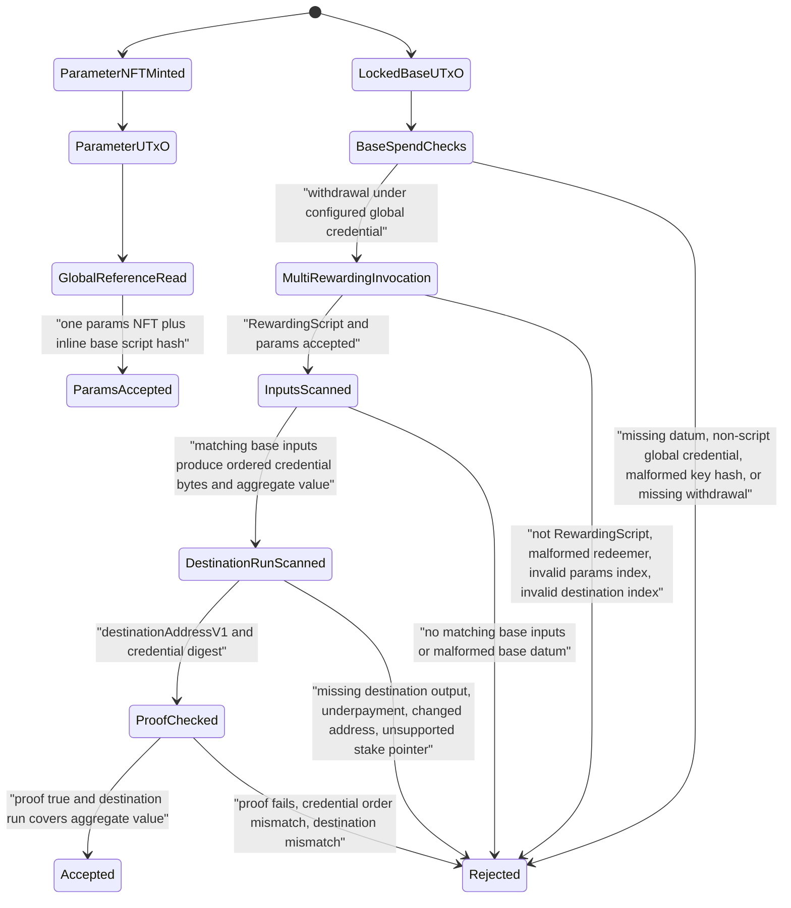

# Cardano eUTxO Context Report

## Scope Manifest

- Target repository root: `/home/gumbo/playground/proof-zk-recovery/proof-tool`.
- Pinned commit: `e4285e414941d12801a1a194a570cc0c111ecd53`; worktree was dirty before this audit, including contract, test, app, docs, and generated fixture changes shown by `git status --short`.
- Focus entrypoint: `mkMultiReclaimGlobal`, exported from `contracts/ownership-verifier/src/Ownership/ReclaimGlobalMulti.hs:12` and implemented at `contracts/ownership-verifier/src/Ownership/ReclaimGlobalMulti.hs:477`.
- Included on-chain modules: `Ownership.ReclaimGlobalMulti` exports the target validator and multi helpers at `contracts/ownership-verifier/src/Ownership/ReclaimGlobalMulti.hs:7`; `Ownership.ReclaimBase` exports the base spending validator at `contracts/ownership-verifier/src/Ownership/ReclaimBase.hs:9`; `Ownership.ReclaimGlobal` is the single-proof comparison validator at `contracts/ownership-verifier/src/Ownership/ReclaimGlobal.hs:7`; `Ownership.OneShotNFT` exports the parameter-token policy at `contracts/ownership-verifier/src/Ownership/OneShotNFT.hs:4`; `Ownership.Verify` exports verifier primitives at `contracts/ownership-verifier/src/Ownership/Verify.hs:5`.
- Included specs and plans: `docs/reclaim-contracts-spec.md:1`, `docs/reclaim-global-multi-proof-fixture-plan.md:1`, `docs/reclaim-global-multi-credential-plan.md:1`, `docs/reclaim-destination-binding-plan.md:1`, and `docs/reclaim-contract-audit-context.md:1`.
- Included support evidence: `contracts/ownership-verifier/test/VerifySpec.hs:20` imports `Ownership.ReclaimGlobalMulti`; `contracts/ownership-verifier/test-support/ScriptContextBuilder.hs:324` constructs rewarding-script contexts; `internal/circuit/ownershipmulti/circuit.go:21` defines the off-chain multi circuit constants used for public-input alignment; `internal/circuit/ownershipmulti/circuit_test.go:22` tests the off-chain digest; `internal/prover/prover_test.go:144` contains the gated full multi-proof round trip.
- Excluded from finding scope except for mitigation notes: frontend and helper transaction-building code. The app surfaces are listed in the dirty worktree, but the requested target is on-chain `mkMultiReclaimGlobal`.
- Unresolved scope questions: whether the deployment reward credential is guaranteed never to hold withdrawable staking rewards is not stated in the included reclaim specs; the base spec only says the withdrawal amount is not meaningful at `docs/reclaim-contracts-spec.md:64`, and current tests explicitly accept a nonzero base withdrawal at `contracts/ownership-verifier/test/VerifySpec.hs:132`.

## Entrypoint Table

| Contract | Entrypoint | Purpose | Parameters | Redeemer / Datum | Required tx material | Value movement |
| --- | --- | --- | --- | --- | --- | --- |
| ReclaimGlobalMulti | `mkMultiReclaimGlobal` at `contracts/ownership-verifier/src/Ownership/ReclaimGlobalMulti.hs:477` | Rewarding script gate; it requires `ScriptInfo` constructor tag `2` at `contracts/ownership-verifier/src/Ownership/ReclaimGlobalMulti.hs:498` | `CurrencySymbol paramsCurrencySymbol` and `verifierKey` at `contracts/ownership-verifier/src/Ownership/ReclaimGlobalMulti.hs:478` | Redeemer fields are `reclaimParamsIdx`, `reclaimDestinationOutIdx`, and `reclaimProof` at `contracts/ownership-verifier/src/Ownership/ReclaimGlobalMulti.hs:51` | Reference input at `txInfoReferenceInputs[reclaimParamsIdx]` selected by `findReferenceInputAtData` at `contracts/ownership-verifier/src/Ownership/ReclaimGlobalMulti.hs:502`; output suffix starts at `reclaimDestinationOutIdx` at `contracts/ownership-verifier/src/Ownership/ReclaimGlobalMulti.hs:505`; spending inputs are scanned from `txInfoInputs` at `contracts/ownership-verifier/src/Ownership/ReclaimGlobalMulti.hs:513` | Aggregates all matching base-input values at `contracts/ownership-verifier/src/Ownership/ReclaimGlobalMulti.hs:250` and requires `requiredValue Value.leq destinationValue` at `contracts/ownership-verifier/src/Ownership/ReclaimGlobalMulti.hs:444` |
| ReclaimBase | `reclaimBaseValidator` at `contracts/ownership-verifier/src/Ownership/ReclaimBase.hs:73` | Spending validator for reclaimable UTxOs | `globalCredential :: Credential` at `contracts/ownership-verifier/src/Ownership/ReclaimBase.hs:74` | Inline `ReclaimBaseDatum { reclaimPaymentKeyHash }` at `contracts/ownership-verifier/src/Ownership/ReclaimBase.hs:35` | Requires a `ScriptCredential` at `contracts/ownership-verifier/src/Ownership/ReclaimBase.hs:66`; requires datum from `SpendingScript _ (Just datum)` at `contracts/ownership-verifier/src/Ownership/ReclaimBase.hs:52`; requires `globalCredential` in `txInfoWdrl` at `contracts/ownership-verifier/src/Ownership/ReclaimBase.hs:59` | Does not inspect outputs or proofs; it gates on withdrawal presence and a 28-byte datum key hash at `contracts/ownership-verifier/src/Ownership/ReclaimBase.hs:76` |
| ReclaimGlobal | `reclaimGlobalValidator` at `contracts/ownership-verifier/src/Ownership/ReclaimGlobal.hs:560` | Single-proof-per-input rewarding comparison path | `CurrencySymbol` and verifier key at `contracts/ownership-verifier/src/Ownership/ReclaimGlobal.hs:529` | `ReclaimGlobalRedeemer` includes params index, destination-output start index, and proofs at `contracts/ownership-verifier/src/Ownership/ReclaimGlobal.hs:49` | Reference params are decoded at `contracts/ownership-verifier/src/Ownership/ReclaimGlobal.hs:548`; destination outputs are selected at `contracts/ownership-verifier/src/Ownership/ReclaimGlobal.hs:552`; base inputs are matched by script hash at `contracts/ownership-verifier/src/Ownership/ReclaimGlobal.hs:372` | Requires one corresponding destination output per matching base input and checks `inputValue Value.leq destinationValue` at `contracts/ownership-verifier/src/Ownership/ReclaimGlobal.hs:404` |
| OneShotNFT | `oneShotNFTPolicy` at `contracts/ownership-verifier/src/Ownership/OneShotNFT.hs:46` | Minting policy for parameter NFT | `TxOutRef seedRef` at `contracts/ownership-verifier/src/Ownership/OneShotNFT.hs:47` | Unit redeemer in tests at `contracts/ownership-verifier/test/VerifySpec.hs:575` | Requires the seed UTxO in `txInfoInputs` at `contracts/ownership-verifier/src/Ownership/OneShotNFT.hs:26` | Requires exactly one token under the policy's own currency symbol at `contracts/ownership-verifier/src/Ownership/OneShotNFT.hs:33` |
| Verify | `groth16VerifyCommittedParsed` at `contracts/ownership-verifier/src/Ownership/Verify.hs:303` | BSB22 committed Groth16 proof checker | Parsed VK, proof, scalar at `contracts/ownership-verifier/src/Ownership/Verify.hs:303` | Proof bytes and public scalar | Computes committed proof material at `contracts/ownership-verifier/src/Ownership/Verify.hs:238`; checks Groth16 pairing and commitment proof at `contracts/ownership-verifier/src/Ownership/Verify.hs:306` | No ledger value movement |

## State Graph

- Parameter token continuity: `oneShotNFTPolicy` requires the seed ref to be spent at `contracts/ownership-verifier/src/Ownership/OneShotNFT.hs:26` and exactly one own token quantity `1` at `contracts/ownership-verifier/src/Ownership/OneShotNFT.hs:33`; `mkMultiReclaimGlobal` later requires the referenced output to hold the parameter currency symbol and one token at `contracts/ownership-verifier/src/Ownership/ReclaimGlobalMulti.hs:175`.
- Parameter datum continuity: `reclaimGlobalMultiParamsData` stores the base script hash as constructor field 0 at `contracts/ownership-verifier/src/Ownership/ReclaimGlobalMulti.hs:59`; `decodeParamsScriptHash` reads inline datum field 0 at `contracts/ownership-verifier/src/Ownership/ReclaimGlobalMulti.hs:222`; the spec says the params datum is `ReclaimGlobalParams { reclaimBaseScriptHash :: ScriptHash }` at `docs/reclaim-contracts-spec.md:94`.
- Base UTxO datum continuity: `ReclaimBaseDatum` stores the payment key hash at `contracts/ownership-verifier/src/Ownership/ReclaimBase.hs:35`; `scanMultiReclaimInputs` decodes that datum from each matching base input at `contracts/ownership-verifier/src/Ownership/ReclaimGlobalMulti.hs:263`; both base and multi paths require the hash length to be 28 bytes at `contracts/ownership-verifier/src/Ownership/ReclaimBase.hs:42` and `contracts/ownership-verifier/src/Ownership/ReclaimGlobalMulti.hs:267`.
- Credential order continuity: the multi plan requires credentials ordered by matching `txInfoInputs` ledger order at `docs/reclaim-global-multi-credential-plan.md:101`; `scanMultiReclaimInputs` traverses the raw input list recursively and appends each hash at `contracts/ownership-verifier/src/Ownership/ReclaimGlobalMulti.hs:250`; real-proof tests reject swapped input order at `contracts/ownership-verifier/test/VerifySpec.hs:425`.
- Destination continuity: the multi plan defines the destination output index and same-address contiguous run at `docs/reclaim-global-multi-credential-plan.md:144`; `dropDataAt` selects the suffix at `contracts/ownership-verifier/src/Ownership/ReclaimGlobalMulti.hs:157`; `scanDestinationOutputs` uses the first output address and value at `contracts/ownership-verifier/src/Ownership/ReclaimGlobalMulti.hs:389`; `accumulateDestinationValue` adds immediately following outputs with the same address and stops at the first different address at `contracts/ownership-verifier/src/Ownership/ReclaimGlobalMulti.hs:406`.
- Proof/public input continuity: the on-chain domain is `ROOT-OWNERSHIP-MULTI-v1` at `contracts/ownership-verifier/src/Ownership/ReclaimGlobalMulti.hs:350`; the digest is `domain || count || credentialBytes || destinationBytes` at `contracts/ownership-verifier/src/Ownership/ReclaimGlobalMulti.hs:361`; the Go circuit uses the same domain, count, credential length, and destination length at `internal/circuit/ownershipmulti/circuit.go:21`; the Go test constructs the same preimage at `internal/circuit/ownershipmulti/circuit_test.go:22`; the Haskell test checks the exported `multi-count2-pub.hex` equals the contract digest at `contracts/ownership-verifier/test/VerifySpec.hs:283`.

## Branch Cards

### Branch: ReclaimBase Spend Gate

- Purpose: allow a base UTxO spend only when the configured global script withdrawal is present; the purpose is described at `docs/reclaim-contracts-spec.md:15`.
- Inputs and assumptions: the base validator receives `globalCredential` at `contracts/ownership-verifier/src/Ownership/ReclaimBase.hs:74`; the datum must decode from the spending script info at `contracts/ownership-verifier/src/Ownership/ReclaimBase.hs:52`; the withdrawal map is read with `Map.lookup` at `contracts/ownership-verifier/src/Ownership/ReclaimBase.hs:59`.
- Outputs and effects: the base validator does not validate proofs or inspect outputs; the spec assigns proof coverage to the rewarding script at `docs/reclaim-contracts-spec.md:52`.
- Block-by-block reasoning: it rejects non-script global credentials at `contracts/ownership-verifier/src/Ownership/ReclaimBase.hs:76`; it rejects missing or malformed datum at `contracts/ownership-verifier/src/Ownership/ReclaimBase.hs:77`; it rejects key hashes not exactly 28 bytes at `contracts/ownership-verifier/src/Ownership/ReclaimBase.hs:78`; it rejects missing withdrawal at `contracts/ownership-verifier/src/Ownership/ReclaimBase.hs:79`.
- Cross-function continuity: the target multi validator identifies these spent outputs by the base script hash in the params datum at `contracts/ownership-verifier/src/Ownership/ReclaimGlobalMulti.hs:229` and decodes the same datum shape at `contracts/ownership-verifier/src/Ownership/ReclaimGlobalMulti.hs:243`.
- Invariants: `globalCredential` must be a `ScriptCredential` at `contracts/ownership-verifier/src/Ownership/ReclaimBase.hs:66`; a datum must be present in the spending context at `contracts/ownership-verifier/src/Ownership/ReclaimBase.hs:52`; `reclaimPaymentKeyHash` must be 28 bytes at `contracts/ownership-verifier/src/Ownership/ReclaimBase.hs:42`; a withdrawal key must be present at `contracts/ownership-verifier/src/Ownership/ReclaimBase.hs:59`.
- Assumptions: the global withdrawal script is executed by the ledger when `txInfoWdrl` contains the script credential, consistent with tests using `withRewardingScript` at `contracts/ownership-verifier/test-support/ScriptContextBuilder.hs:324`; the withdrawal amount is intended to be semantically ignored per `docs/reclaim-contracts-spec.md:64`; the base script hash in the params datum corresponds to the same base instance that required the global credential; spending inputs cannot be modified by third parties after transaction signing; the base UTxO datum is written by the depositor and treated as untrusted input at `docs/reclaim-contract-audit-context.md:96`.

### Branch: Parameter Reference Resolution

- Purpose: bind the global validator to a deployed base script hash through an NFT-identified reference UTxO; the spec defines the parameter UTxO at `docs/reclaim-contracts-spec.md:85`.
- Inputs and assumptions: the redeemer carries `reclaimParamsIdx` at `contracts/ownership-verifier/src/Ownership/ReclaimGlobalMulti.hs:52`; `findReferenceInputAtData` indexes `txInfoReferenceInputs` at `contracts/ownership-verifier/src/Ownership/ReclaimGlobalMulti.hs:152`; the referenced output's inline datum is decoded at `contracts/ownership-verifier/src/Ownership/ReclaimGlobalMulti.hs:222`.
- Outputs and effects: the decoded base script hash selects which spending inputs are protected by this invocation at `contracts/ownership-verifier/src/Ownership/ReclaimGlobalMulti.hs:504`.
- Block-by-block reasoning: negative and out-of-bounds indices fail in `findDataAt` at `contracts/ownership-verifier/src/Ownership/ReclaimGlobalMulti.hs:134`; `hasExactlyOneParamToken` checks the configured policy id and exactly one token under that policy at `contracts/ownership-verifier/src/Ownership/ReclaimGlobalMulti.hs:175`; `validateParams` wraps that check at `contracts/ownership-verifier/src/Ownership/ReclaimGlobalMulti.hs:472`.
- Cross-function continuity: `OneShotNFT` supplies uniqueness through a seed-ref spend and one-token mint at `contracts/ownership-verifier/src/Ownership/OneShotNFT.hs:46`; tests construct the params reference at an `always-fails` script address at `contracts/ownership-verifier/test/VerifySpec.hs:730`.
- Invariants: params index must be valid; referenced output must include the configured policy id; exactly one token under that policy must have quantity `1`; params inline datum field 0 must decode to the base script hash; the base script hash gates input scanning.
- Assumptions: the params NFT policy has only one minted own token per policy id at `contracts/ownership-verifier/src/Ownership/OneShotNFT.hs:33`; the parameter output remains immutable because it is held by an always-fails script as specified at `docs/reclaim-contracts-spec.md:89`; no on-chain check in `mkMultiReclaimGlobal` verifies the holder address is always-fails; extra unrelated assets on the parameter UTxO are not explicitly prohibited by `hasExactlyOneParamToken` at `contracts/ownership-verifier/src/Ownership/ReclaimGlobalMulti.hs:175`; the map order of `Value` data makes the intended parameter policy reachable as the first non-Ada entry used by `contracts/ownership-verifier/src/Ownership/ReclaimGlobalMulti.hs:178`.

### Branch: Multi Base-Input Scan

- Purpose: collect the exact credential sequence and aggregate protected value for every matching base input; the design says to traverse `txInfoInputs` in ledger order at `docs/reclaim-global-multi-credential-plan.md:149`.
- Inputs and assumptions: `scanMultiReclaimInputs` receives the base script hash and raw input list at `contracts/ownership-verifier/src/Ownership/ReclaimGlobalMulti.hs:250`; `isReclaimBaseInput` compares the resolved output payment credential to the base script hash at `contracts/ownership-verifier/src/Ownership/ReclaimGlobalMulti.hs:229`.
- Outputs and effects: it returns `(credentialCount, credentialBytes, requiredValue)` at `contracts/ownership-verifier/src/Ownership/ReclaimGlobalMulti.hs:257`.
- Block-by-block reasoning: non-base inputs are skipped at `contracts/ownership-verifier/src/Ownership/ReclaimGlobalMulti.hs:278`; each base input appends a 28-byte payment key hash at `contracts/ownership-verifier/src/Ownership/ReclaimGlobalMulti.hs:267`; each base input's value is added to `requiredValue` at `contracts/ownership-verifier/src/Ownership/ReclaimGlobalMulti.hs:274`; absence of any base input fails at `contracts/ownership-verifier/src/Ownership/ReclaimGlobalMulti.hs:257`.
- Cross-function continuity: `decodeBasePaymentKeyHash` reads the same constructor field used by `ReclaimBaseDatum` at `contracts/ownership-verifier/src/Ownership/ReclaimGlobalMulti.hs:243`; tests verify omitted, changed, and reordered credentials fail in callback mode at `contracts/ownership-verifier/test/VerifySpec.hs:293`, `contracts/ownership-verifier/test/VerifySpec.hs:301`, and `contracts/ownership-verifier/test/VerifySpec.hs:309`; real-proof tests reject swapped inputs and changed datums at `contracts/ownership-verifier/test/VerifySpec.hs:425` and `contracts/ownership-verifier/test/VerifySpec.hs:431`.
- Invariants: at least one matching base input must exist; every matching base input contributes exactly one 28-byte credential hash; credentials are concatenated in input order; required value is the full multi-asset sum of matching base input values; non-base inputs consume no proof material.
- Assumptions: `TxOut` values in spent outputs are nonnegative ledger values; duplicate credentials are allowed when every matching input is represented in order, as tested at `contracts/ownership-verifier/test/VerifySpec.hs:393`; the matching base script hash is the only intended ownership boundary for base inputs.

### Branch: Destination Run and Value Coverage

- Purpose: bind the proof to one destination address and require that the contiguous destination run covers all reclaimed value; the plan states this at `docs/reclaim-global-multi-credential-plan.md:144`.
- Inputs and assumptions: redeemer field `reclaimDestinationOutIdx` is read at `contracts/ownership-verifier/src/Ownership/ReclaimGlobalMulti.hs:494`; `dropDataAt` selects the suffix at `contracts/ownership-verifier/src/Ownership/ReclaimGlobalMulti.hs:157`; the first suffix output determines both destination bytes and initial value at `contracts/ownership-verifier/src/Ownership/ReclaimGlobalMulti.hs:389`.
- Outputs and effects: `scanDestinationOutputs` returns `(destinationBytes, destinationValue)` at `contracts/ownership-verifier/src/Ownership/ReclaimGlobalMulti.hs:390`; `validateMultiReclaimInputs` rejects if `requiredValue` is not `Value.leq destinationValue` at `contracts/ownership-verifier/src/Ownership/ReclaimGlobalMulti.hs:444`.
- Block-by-block reasoning: invalid output index fails through `dropDataAt` at `contracts/ownership-verifier/src/Ownership/ReclaimGlobalMulti.hs:157`; missing first output fails at `contracts/ownership-verifier/src/Ownership/ReclaimGlobalMulti.hs:392`; same-address following outputs are added at `contracts/ownership-verifier/src/Ownership/ReclaimGlobalMulti.hs:415`; the first different address stops accumulation at `contracts/ownership-verifier/src/Ownership/ReclaimGlobalMulti.hs:418`.
- Cross-function continuity: destination bytes are encoded as a fixed 58-byte `destinationAddressV1` at `contracts/ownership-verifier/src/Ownership/ReclaimGlobalMulti.hs:337`; the destination-binding plan defines the 58-byte payment/stake credential layout at `docs/reclaim-destination-binding-plan.md:94`; tests cover exact payment, overpayment, contiguous splits, gap stopping, and native-asset underpayment at `contracts/ownership-verifier/test/VerifySpec.hs:333`, `contracts/ownership-verifier/test/VerifySpec.hs:341`, `contracts/ownership-verifier/test/VerifySpec.hs:349`, `contracts/ownership-verifier/test/VerifySpec.hs:357`, and `contracts/ownership-verifier/test/VerifySpec.hs:365`.
- Invariants: destination address bytes are computed on-chain from the selected `TxOut`; the proof uses the same destination bytes; the value comparison is full multi-asset `Value.leq`; only contiguous same-address outputs starting at the selected index are counted; outputs after an intervening different address do not count.
- Assumptions: stake pointers are intentionally unsupported and fail at `contracts/ownership-verifier/src/Ownership/ReclaimGlobalMulti.hs:331`; Plutus V3 address constructor tags match the encoder assumptions listed at `docs/reclaim-destination-binding-plan.md:136`; network id is not part of the Plutus `Address` bytes per `docs/reclaim-destination-binding-plan.md:90`.

### Branch: Multi Proof Verification

- Purpose: verify that one proof authorizes all ordered credentials to the chosen destination; the claim is stated at `docs/reclaim-global-multi-credential-plan.md:8`.
- Inputs and assumptions: the parsed VK comes from the script parameter at `contracts/ownership-verifier/src/Ownership/ReclaimGlobalMulti.hs:496`; the proof is redeemer field 2 at `contracts/ownership-verifier/src/Ownership/ReclaimGlobalMulti.hs:495`; credential count, credential bytes, and destination bytes are produced by the scan branches.
- Outputs and effects: `verifyMultiOwnershipWithParsedVK` checks the proof against `multiCredentialPublicInputDigest` at `contracts/ownership-verifier/src/Ownership/ReclaimGlobalMulti.hs:375`; proof failure rejects at `contracts/ownership-verifier/src/Ownership/ReclaimGlobalMulti.hs:449`.
- Block-by-block reasoning: `multiCredentialCountU16BE` requires count `1..65535` at `contracts/ownership-verifier/src/Ownership/ReclaimGlobalMulti.hs:354`; `multiCredentialPublicInputDigest` requires `credentialBytes == credentialCount * 28` and `destinationBytes == 58` at `contracts/ownership-verifier/src/Ownership/ReclaimGlobalMulti.hs:361`; `groth16VerifyCommittedParsed` verifies the committed proof and PoK at `contracts/ownership-verifier/src/Ownership/Verify.hs:303`.
- Cross-function continuity: the off-chain circuit uses `Domain = "ROOT-OWNERSHIP-MULTI-v1"` and destination length `58` at `internal/circuit/ownershipmulti/circuit.go:21`; the circuit derives all credentials and binds them plus destination to public `Pub` at `internal/circuit/ownershipmulti/circuit.go:79`; tests reject reordered credentials and changed destination off-chain at `internal/prover/prover_test.go:199` and `internal/prover/prover_test.go:213`; production-entrypoint Haskell tests accept the exported real multi proof and reject destination/order/value changes at `contracts/ownership-verifier/test/VerifySpec.hs:407`.
- Invariants: the proof statement includes credential count; the credential bytes are ordered and fixed length; destination bytes are fixed length; the verifier key is a script parameter committed into the global validator hash per spec at `docs/reclaim-contracts-spec.md:80`; single-credential proofs reject on the multi path at `contracts/ownership-verifier/test/VerifySpec.hs:401`.
- Assumptions: the deployed verifier key corresponds to the credential count used by the transaction; mismatched counts should fail proof verification absent a cryptographic collision; malformed proof and VK bytes fail through BLS decompression or pairing checks in `Ownership.Verify`.

## Compliance Matrix

| Spec claim | Enforcing code path | Status | Gap notes |
| --- | --- | --- | --- |
| Base UTxO datum contains a 28-byte payment key hash, `docs/reclaim-contracts-spec.md:30` | Datum type at `contracts/ownership-verifier/src/Ownership/ReclaimBase.hs:35`; base length check at `contracts/ownership-verifier/src/Ownership/ReclaimBase.hs:42`; multi length check at `contracts/ownership-verifier/src/Ownership/ReclaimGlobalMulti.hs:267` | Enforced | Malformed raw data fails through datum decoding or unsafe field reads. |
| Base spends require a script-credential withdrawal, `docs/reclaim-contracts-spec.md:48` | Script credential check at `contracts/ownership-verifier/src/Ownership/ReclaimBase.hs:66`; withdrawal lookup at `contracts/ownership-verifier/src/Ownership/ReclaimBase.hs:59` | Enforced | Amount is intentionally ignored per `docs/reclaim-contracts-spec.md:64`; this is logged as an area of interest. |
| Global multi script purpose must be RewardingScript, `docs/reclaim-global-multi-credential-plan.md:141` | Constructor tag check at `contracts/ownership-verifier/src/Ownership/ReclaimGlobalMulti.hs:498` | Enforced for target | The single `ReclaimGlobal` comparison path does not have the same explicit purpose check at `contracts/ownership-verifier/src/Ownership/ReclaimGlobal.hs:529`. |
| Parameter reference input index must be valid, `docs/reclaim-contracts-spec.md:122` | `findDataAt` rejects negative and out-of-bounds indices at `contracts/ownership-verifier/src/Ownership/ReclaimGlobalMulti.hs:134` | Enforced | Test coverage rejects an invalid parameter index for single path at `contracts/ownership-verifier/test/VerifySpec.hs:155`; multi direct invalid params-index coverage was not separately observed. |
| Parameter output contains one parameter NFT under configured policy, `docs/reclaim-contracts-spec.md:87` | `hasExactlyOneParamToken` policy and single-token checks at `contracts/ownership-verifier/src/Ownership/ReclaimGlobalMulti.hs:175` | Partially Enforced | It checks the first non-Ada policy entry and exactly one token under that policy, but it does not prove the holder script is always-fails. |
| Parameter datum stores base script hash, `docs/reclaim-contracts-spec.md:94` | `decodeParamsScriptHash` at `contracts/ownership-verifier/src/Ownership/ReclaimGlobalMulti.hs:222` | Enforced | The datum shape is raw decoded; malformed data rejects by evaluation failure. |
| Traverse `txInfoInputs` in ledger order and include every matching base input, `docs/reclaim-global-multi-credential-plan.md:149` | `scanMultiReclaimInputs` recursion at `contracts/ownership-verifier/src/Ownership/ReclaimGlobalMulti.hs:250` | Enforced | Tests reject omitted, changed, and reordered credential material at `contracts/ownership-verifier/test/VerifySpec.hs:293`, `contracts/ownership-verifier/test/VerifySpec.hs:301`, and `contracts/ownership-verifier/test/VerifySpec.hs:425`. |
| Destination output address is computed on-chain, `docs/reclaim-contracts-spec.md:147` | `destinationAddressV1FromTxOutData` at `contracts/ownership-verifier/src/Ownership/ReclaimGlobalMulti.hs:337` | Enforced | Stake pointers are unsupported by design at `contracts/ownership-verifier/src/Ownership/ReclaimGlobalMulti.hs:331`. |
| Contiguous destination run covers aggregate value, `docs/reclaim-global-multi-credential-plan.md:146` | `accumulateDestinationValue` at `contracts/ownership-verifier/src/Ownership/ReclaimGlobalMulti.hs:406`; `Value.leq` at `contracts/ownership-verifier/src/Ownership/ReclaimGlobalMulti.hs:444` | Enforced | Tests cover contiguous split and gap stop at `contracts/ownership-verifier/test/VerifySpec.hs:413` and `contracts/ownership-verifier/test/VerifySpec.hs:455`. |
| Full multi-asset value comparison, `docs/reclaim-global-multi-credential-plan.md:162` | `Value.leq` at `contracts/ownership-verifier/src/Ownership/ReclaimGlobalMulti.hs:444` | Enforced | Real-proof test rejects native-asset underpayment at `contracts/ownership-verifier/test/VerifySpec.hs:461`. |
| Single proof cannot be reused for multi path, `docs/reclaim-global-multi-proof-fixture-plan.md:189` | Multi domain/count digest at `contracts/ownership-verifier/src/Ownership/ReclaimGlobalMulti.hs:350`; real test at `contracts/ownership-verifier/test/VerifySpec.hs:401` | Enforced | Relies on distinct VK/proof artifacts in deployment. |
| Transactions with no reclaim-base inputs fail, `docs/reclaim-contracts-spec.md:152` | `scanMultiReclaimInputs` errors when `sawBase` is false at `contracts/ownership-verifier/src/Ownership/ReclaimGlobalMulti.hs:257` | Enforced | Real-proof test rejects no matching inputs at `contracts/ownership-verifier/test/VerifySpec.hs:467`. |
| Parameter UTxO is locked at always-fails holder, `docs/reclaim-contracts-spec.md:89` | No direct check in target; tests construct params input at `always-fails` address at `contracts/ownership-verifier/test/VerifySpec.hs:730` | Partially Enforced | This is a deployment invariant, not a target-validator invariant. |

## Threat Boundary Table

| Actor | Controllable tx fields | Trust assumptions | Protected invariants | Worst-case capability observed in context |
| --- | --- | --- | --- | --- |
| Unprivileged user / claimant | Spending inputs, reference-input index, destination-output index, outputs, proof bytes, withdrawal amount, mint/burn fields, signers | Claimant may know a valid master key for one or more base datums; redeemer material is untrusted | Cannot reclaim base inputs unless all matching credentials and the selected destination satisfy the multi proof at `contracts/ownership-verifier/src/Ownership/ReclaimGlobalMulti.hs:435`; cannot underpay destination run due `Value.leq` at `contracts/ownership-verifier/src/Ownership/ReclaimGlobalMulti.hs:444` | Can create a valid reclaim transaction for credentials they control; can choose non-base inputs without consuming proof material at `contracts/ownership-verifier/src/Ownership/ReclaimGlobalMulti.hs:278`; withdrawal amount handling is an area of interest because `ReclaimBase` ignores amount at `contracts/ownership-verifier/src/Ownership/ReclaimBase.hs:59`. |
| Depositor | Base UTxO datum and value | Datum is untrusted; value is ledger-constrained | Bad datum length is rejected by base and global paths at `contracts/ownership-verifier/src/Ownership/ReclaimBase.hs:78` and `contracts/ownership-verifier/src/Ownership/ReclaimGlobalMulti.hs:267` | Can lock funds under an unreclaimable or wrong credential datum, causing self-inflicted liveness loss. |
| Privileged deployer / parameter creator | Parameter NFT seed, params UTxO datum, holder address, verifier key script parameter, base/global script pairing | Must mint exactly one params NFT through the one-shot policy and hold it immutably as specified at `docs/reclaim-contracts-spec.md:89`; verifier key must match the intended circuit | Parameter NFT identifies the base script hash at `contracts/ownership-verifier/src/Ownership/ReclaimGlobalMulti.hs:222`; global script hash commits to verifier key as described at `docs/reclaim-contracts-spec.md:80` | If deployment places the params NFT at a mutable holder, the on-chain target only checks token/datum, not holder immutability. |
| Off-chain builder / integrator | Input ordering, proof-generation ordering, destination-output placement, change outputs, fee inputs | Fully untrusted for validation; should preserve order for UX success | On-chain input scan and destination bytes are source of truth at `contracts/ownership-verifier/src/Ownership/ReclaimGlobalMulti.hs:250` and `contracts/ownership-verifier/src/Ownership/ReclaimGlobalMulti.hs:337` | Builder mistakes produce rejected transactions; wrong output index or non-contiguous value fails as tested at `contracts/ownership-verifier/test/VerifySpec.hs:443` and `contracts/ownership-verifier/test/VerifySpec.hs:455`. |
| Oracle / relayer | Not present in this target flow | No oracle dependency was observed in included on-chain modules | N/A | No oracle-specific capability. |
| EVM-style reentrant callee | N/A in native Cardano eUTxO | Cardano transactions are statically validated, not call-stack based | N/A | Reentrancy category should be marked N/A for this target. |

## Context Closure Gate

- Result: PASS
- Gaps:
  - Deployment immutability of the params holder is a documented assumption at `docs/reclaim-contracts-spec.md:89`, while `mkMultiReclaimGlobal` validates token/datum rather than holder address at `contracts/ownership-verifier/src/Ownership/ReclaimGlobalMulti.hs:472`.
  - Reward withdrawal amount semantics are explicitly ignored in the base spec at `docs/reclaim-contracts-spec.md:64`, and tests accept nonzero base withdrawal presence at `contracts/ownership-verifier/test/VerifySpec.hs:132`; the target global validator does not inspect `txInfoWdrl` amount in `contracts/ownership-verifier/src/Ownership/ReclaimGlobalMulti.hs:483`.
  - The dirty worktree means the audit is of the current local state, not a clean committed release snapshot.
- Closure rationale:
  - Every target entrypoint and support branch is mapped with file-line evidence.
  - State/control assets are mapped: base datum key hash, params NFT, params datum base script hash, destination output run, verifier key, proof bytes, and withdrawal credential.
  - Critical invariants have code and test references, including credential ordering, destination binding, aggregate value coverage, real-proof acceptance, and rejection of changed order/destination/value.
  - Unresolved assumptions are logged with impact.
  - No evidence-free findings are emitted in this context phase.

## Areas of Interest

1. Reward withdrawal amount boundary. `ReclaimBase` treats any `Map.lookup globalCredential txInfoWdrl` hit as present at `contracts/ownership-verifier/src/Ownership/ReclaimBase.hs:59`, the spec says the amount is not meaningful at `docs/reclaim-contracts-spec.md:64`, and the target global validator reads inputs/reference inputs/outputs but not `txInfoWdrl` at `contracts/ownership-verifier/src/Ownership/ReclaimGlobalMulti.hs:483`. The scanner should decide whether nonzero rewards under the global script credential are an out-of-scope deployment invariant or a confirmed staking-credential value leak.
2. Parameter holder immutability. The spec says the parameter UTxO is locked at an always-fails script address at `docs/reclaim-contracts-spec.md:89`, while the target checks only token/datum via `validateParams` at `contracts/ownership-verifier/src/Ownership/ReclaimGlobalMulti.hs:472`. The scanner should keep this under configuration/deployment trust unless an unprivileged transaction can move or counterfeit the parameter NFT.
3. Parameter `Value` map shape. `hasExactlyOneParamToken` reads `BI.tail valueEntries` and the first non-Ada entry at `contracts/ownership-verifier/src/Ownership/ReclaimGlobalMulti.hs:178`; this can be a liveness/order-sensitivity issue if the params UTxO carries unrelated assets, but no direct unauthorized spend was established in context.
4. Single-path comparison drift. `ReclaimGlobalMulti` explicitly checks `RewardingScript` at `contracts/ownership-verifier/src/Ownership/ReclaimGlobalMulti.hs:498`; the single-path `ReclaimGlobal` comparison code starts validation without an equivalent purpose check at `contracts/ownership-verifier/src/Ownership/ReclaimGlobal.hs:529`. This is outside the focused target unless it composes with shared deployment credentials.
