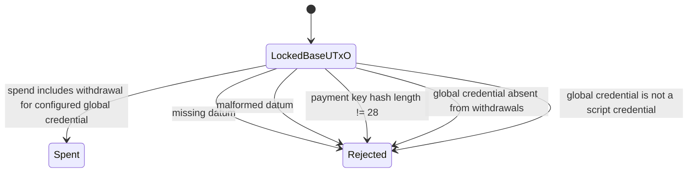
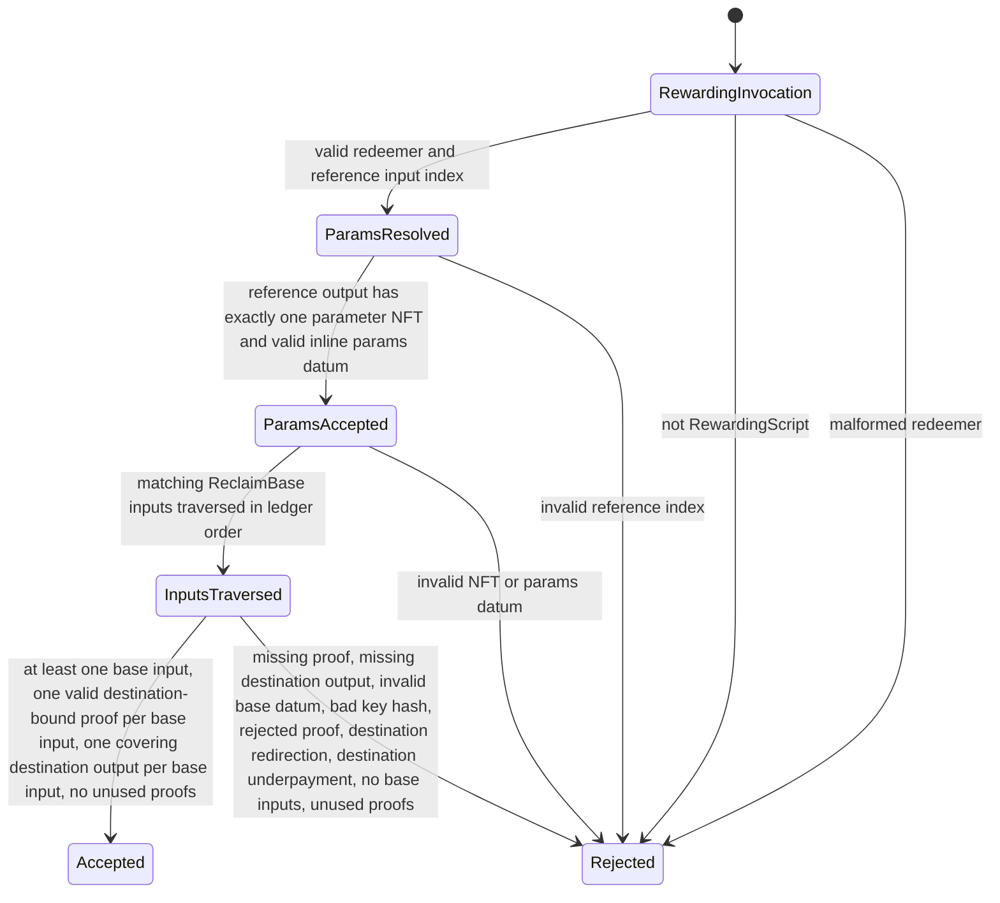

# Reclaim Contract Audit Context

This file provides the context artifacts required by the
`cardano-vulnerability-scanner` skill for the reclaim-base and reclaim-global
contracts.

## Entrypoint Table

| Contract | Entrypoint | File | Purpose | Parameters | Redeemer | Datum |
| --- | --- | --- | --- | --- | --- | --- |
| ReclaimBase | `reclaimBaseValidator` | `contracts/ownership-verifier/src/Ownership/ReclaimBase.hs` | Spending | `Credential` for the global rewarding script | Unit in V3 `scriptContextRedeemer` | `ReclaimBaseDatum { reclaimPaymentKeyHash :: BuiltinByteString }` |
| ReclaimBase | `reclaimBaseValidatorUntyped` | `contracts/ownership-verifier/src/Ownership/ReclaimBase.hs` | Spending wrapper | `Credential` | Encoded inside V3 `ScriptContext` | Inline datum from `SpendingScript _ (Just datum)` |
| ReclaimGlobal | `reclaimGlobalValidator` | `contracts/ownership-verifier/src/Ownership/ReclaimGlobal.hs` | Rewarding | `CurrencySymbol` for the parameter NFT; deployment verifier key bytes | `ReclaimGlobalRedeemer { reclaimParamsIdx, reclaimDestinationOutStartIdx, reclaimProofs }` | Parameter UTxO inline `ReclaimGlobalParams`; base input inline `ReclaimBaseDatum`; corresponding destination output |
| ReclaimGlobal | `reclaimGlobalValidatorUntyped` | `contracts/ownership-verifier/src/Ownership/ReclaimGlobal.hs` | Rewarding wrapper | `CurrencySymbol`, verifier key bytes | Encoded inside V3 `ScriptContext` | Same as typed entrypoint |

## State Graph

### ReclaimBase

### ReclaimGlobal

## Branch Cards

### ReclaimBase Branches

| Branch | Predicate | Accepts When | Rejects When |
| --- | --- | --- | --- |
| Datum present | `reclaimBaseDatumFromContext` returns `Just` | Spending script info carries inline datum decodable as `ReclaimBaseDatum` | Script purpose is not spending, datum is absent, or datum decode fails |
| Key hash length | `validReclaimPaymentKeyHash` | `lengthOfByteString reclaimPaymentKeyHash == 28` | Any other length |
| Global credential shape | `isScriptCredential` | Parameter credential is `ScriptCredential _` | Parameter credential is `PubKeyCredential _` |
| Withdrawal present | `hasReclaimWithdrawal globalCredential ctx` | `globalCredential` is a key in `txInfoWdrl` | Credential absent; amount is ignored |

### ReclaimGlobal Branches

| Branch | Predicate | Accepts When | Rejects When |
| --- | --- | --- | --- |
| Purpose | `scriptContextScriptInfo` | Current purpose is `RewardingScript _` | Any other script purpose |
| Redeemer decode | `fromBuiltinData scriptContextRedeemer` | Decodes as `ReclaimGlobalRedeemer` | Malformed redeemer |
| Parameter ref index | `findReferenceInputAt reclaimParamsIdx txInfoReferenceInputs` | Index is non-negative and in bounds | Negative or out of bounds |
| Parameter NFT | `hasExactlyOneParamToken paramsCurrencySymbol paramsOut` | The parameter output contains one token with quantity `1` under the configured currency symbol | Missing symbol, multiple token names under symbol, or quantity not `1` |
| Parameter datum | `decodeParams paramsOut` | Parameter output has inline datum decodable as `ReclaimGlobalParams` | Missing datum, datum hash only, or malformed datum |
| Base input match | `isReclaimBaseInput reclaimBaseScriptHash txIn` | Input resolved output address is `ScriptCredential reclaimBaseScriptHash` | Non-base inputs are skipped |
| Proof consumption | `validateReclaimInputs` | Exactly one proof consumed per matching base input, in ledger order | Missing proof, unused proof, or zero base inputs |
| Destination output consumption | `validateReclaimInputs` | Exactly one destination output consumed per matching base input, starting at `reclaimDestinationOutStartIdx` | Negative/out-of-bounds start index, missing destination output, or destination output order mismatch |
| Base datum/proof | `validateReclaimInputs` | Base input has inline `ReclaimBaseDatum`, 28-byte key hash, and destination-bound proof accepts for the corresponding output address | Missing/malformed datum, bad key hash length, rejected proof, or proof bound to a different destination |
| Output value policy | `Value.leq` | Corresponding destination output value covers the full input value across all assets | Lovelace underpayment, missing native asset, or insufficient native asset quantity |

## Compliance Matrix

| Requirement | Contract | Implementation Point | Evidence to Check |
| --- | --- | --- | --- |
| Users can lock UTxOs with a datum containing a public key hash | ReclaimBase | `ReclaimBaseDatum` | Datum type has `reclaimPaymentKeyHash :: BuiltinByteString` |
| Base script is parameterized by a credential | ReclaimBase | `reclaimBaseValidator :: Credential -> ScriptContext -> Bool` | Validator parameter type |
| Base credential must invoke a script withdrawal | ReclaimBase | `isScriptCredential` | Rejects key credentials before withdrawal acceptance |
| Base script requires that credential in withdrawals | ReclaimBase | `hasReclaimWithdrawal` | Map lookup in `txInfoWdrl`; amount ignored |
| Base script does not validate proofs | ReclaimBase | `reclaimBaseValidator` | No call to `verifyOwnershipWithVK` |
| Global script is parameterized by a parameter NFT currency symbol and verifier key | ReclaimGlobal | `reclaimGlobalValidator :: CurrencySymbol -> BuiltinByteString -> ScriptContext -> Bool` | Validator parameter type |
| Global redeemer contains parameter reference input index, destination output start index, and ordered proofs | ReclaimGlobal | `ReclaimGlobalRedeemer` | `reclaimParamsIdx`, `reclaimDestinationOutStartIdx`, `reclaimProofs` fields |
| Parameter UTxO must be a reference input | ReclaimGlobal | `findReferenceInputAt` over `txInfoReferenceInputs` | Does not search spending inputs |
| Parameter NFT identifies params datum | ReclaimGlobal | `hasExactlyOneParamToken`, `decodeParams` | Checks NFT and inline datum on same referenced output |
| Global script traverses tx inputs in ledger order | ReclaimGlobal | `validateReclaimInputs` recursion over `txInfoInputs` | Proofs and destination outputs consumed in same recursion |
| Global script verifies every matching base input | ReclaimGlobal | `validateReclaimInputs` | Calls destination-bound verifier with the script-parameter verifier key, base datum key hash, and on-chain destination address bytes |
| Extra or missing proofs fail | ReclaimGlobal | `validateReclaimInputs` terminal cases | Rejects missing and unused proofs |
| No-op global withdrawals fail | ReclaimGlobal | `validateReclaimInputs` saw-base flag | Rejects zero matching base inputs |
| Reclaimed value goes to proof-bound destination output | ReclaimGlobal | `destinationAddressV1FromTxOutData`, `Value.leq`, `validateReclaimInputs` | Tests reject changed destination address, wrong destination index, and underpayment |

## Threat Boundary Table

| Actor / Input | Trusted? | Boundary | Contract Responsibilities |
| --- | --- | --- | --- |
| Depositor writing `ReclaimBaseDatum` | Untrusted | Datum can contain arbitrary bytes | Base and global both require 28-byte payment key hash before proof use |
| Transaction builder | Untrusted | Can choose inputs, reference inputs, redeemer proof order, destination output start index, withdrawals, outputs, and minted/burned values | Scripts enforce withdrawal presence, parameter ref index, NFT presence, proof coverage, destination binding, destination value coverage, and no unused proofs |
| Parameter NFT UTxO creator | Trusted at deployment | Chooses base script hash | One-shot policy makes NFT unique; global checks referenced NFT and inline base-script-hash datum |
| Parameter holder script | Assumed always-fails | Prevents spending/mutation of parameter UTxO after creation | Global only reads it as reference input |
| Ownership proof bytes | Untrusted public input | Redeemer-supplied proof can be malformed, for another key, or for another destination | Global calls destination-bound verifier against base datum key hash and computed destination address bytes |
| Verifier key bytes | Trusted as script parameter | Public verifier key committed to by the global validator hash | Global parses the key once per invocation and uses it for all proof checks |
| Off-chain proof ordering | Untrusted | Proof list order can mismatch input order | Global consumes one proof per matching base input in `txInfoInputs` order |
| Non-base transaction inputs | Untrusted / irrelevant | May be present in same transaction | Global skips inputs not locked by `reclaimBaseScriptHash` |
